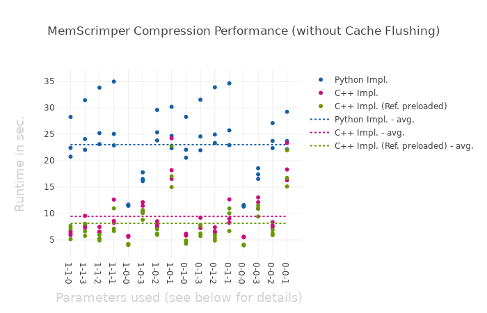
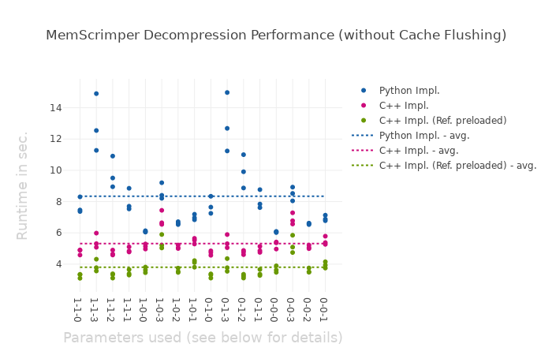
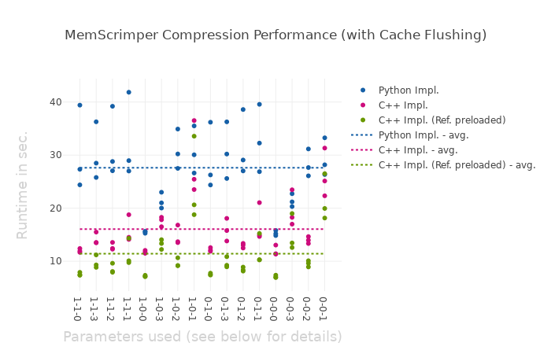
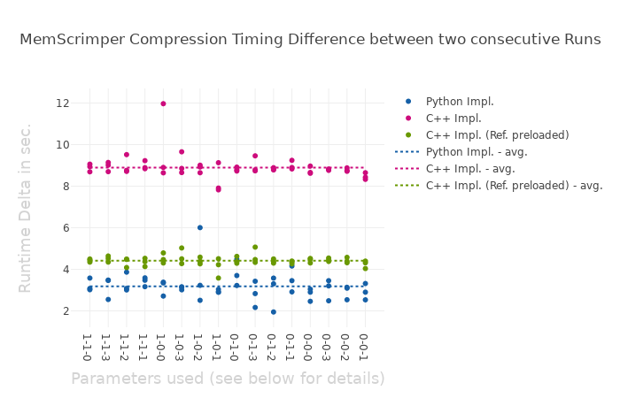
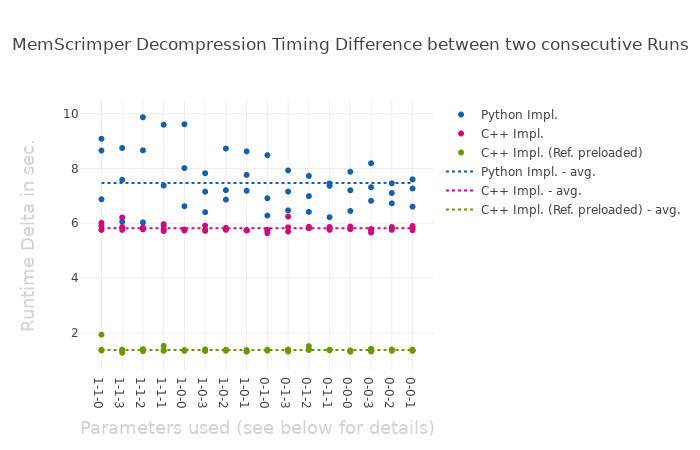

# Memscrimper C++ Implementation

## Dependencies
- Boost Installation
- libbz2.so (libz2.a for static build)
- libz.so (libz.a for static build)

## Building
### Dynamically-Linked Version
```bash
mkdir build_folder && cd build_folder
cmake .. && make
```
### Statically-Linked Version
```bash
mkdir build_folder && cd build_folder
cmake .. -DSTATIC_BUILD=ON && make
```

## Example Usage
Start the MemScrimper server as follows:
```bash
./memscrimper s <thread_count> /tmp/mscr.socket
```
Sending requests via Python module:
```python
import mscr_client

pagesize = 4096
# creating client
mscr = mscr_client.MscrClient("/tmp/mscr.socket", True)

# adding reference dump (for faster compression)
mscr.add_referencedump("path/to/refdump", pagesize)

# send compression request
mscr.compress_dump("path/to/refdump", "path/to/sourcedump", "dump.compress",
                    pagesize, True, True, Compression.ZIP7)
                    
# send decompression request
mscr.decompress_dump("dump.compress", "dump.uncompress")

# remove reference dump from server memory (optional)
mscr.del_referencedump("path/to/refdump")
```

## Performance Comparison
In the following we compared the different runtime using the Python and C++ implementation of MemScrimper. Note that "Ref. preloaded" is talking about preloading the corresponding Reference Dump. This is can be either done by the client member function `add_referencedump` or by processing multiple memory dumps for the same reference dump which is usually the case in production.

Every Test consisted of three different memory dumps which were compressed using different options.

All benchmark tests were performed on a computer using the following hardware:
- CPU: Intel Core i5-6200u @ 2.30Ghz
- Memory: 16 GB DDR4 2133 Mhz
- Storage: SanDisk SD8SNAT-256G-1006

### Performance without Cache Flushing after every De-/Compression


#### Parameter Encoding

##### General Format: *X-Y-Z*

| Position      |     0                       | 1                         |              2           |        3       |
|---------------|-----------------------------|---------------------------|--------------------------|----------------|
| X             | Intradeduplication not used | Intradeduplication used   | /                        | /              |
| Y             | Diffing not used            | Intradeduplication used   | /                        | /              |
| Z             | Inner Compression not used  | 7zip as inner compression |gzip as inner compression | bzip2 as inner compression|

### Performance with explicit Cache Flushing after every De-/Compression



#### Parameter Encoding

##### General Format: *X-Y-Z*

| Position      |     0                       | 1                         |              2           |        3       |
|---------------|-----------------------------|---------------------------|--------------------------|----------------|
| X             | Intradeduplication not used | Intradeduplication used   | /                        | /              |
| Y             | Diffing not used            | Intradeduplication used   | /                        | /              |
| Z             | Inner Compression not used  | 7zip as inner compression |gzip as inner compression | bzip2 as inner compression|

### Performance Comparison between two times the same De-/Compression
This test measures the impact of caches on our runtime.



#### Parameter Encoding

##### General Format: *X-Y-Z*

| Position      |     0                       | 1                         |              2           |        3       |
|---------------|-----------------------------|---------------------------|--------------------------|----------------|
| X             | Intradeduplication not used | Intradeduplication used   | /                        | /              |
| Y             | Diffing not used            | Intradeduplication used   | /                        | /              |
| Z             | Inner Compression not used  | 7zip as inner compression |gzip as inner compression | bzip2 as inner compression|

